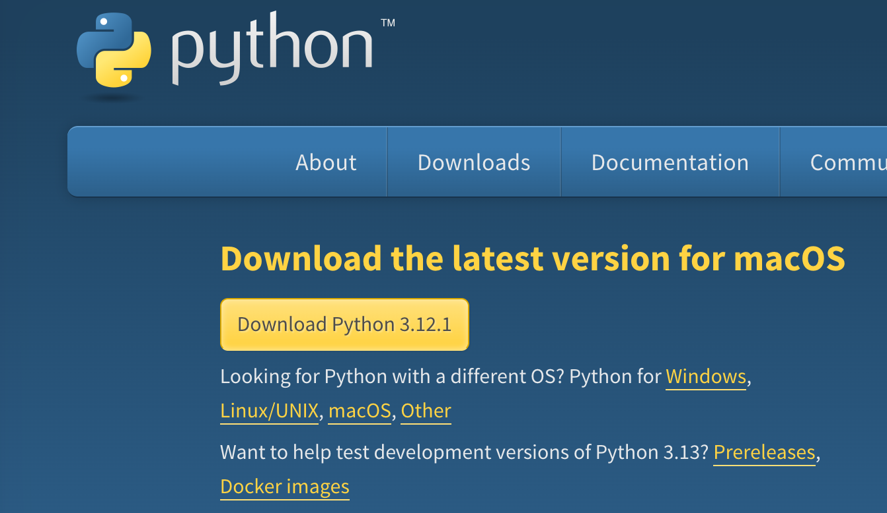
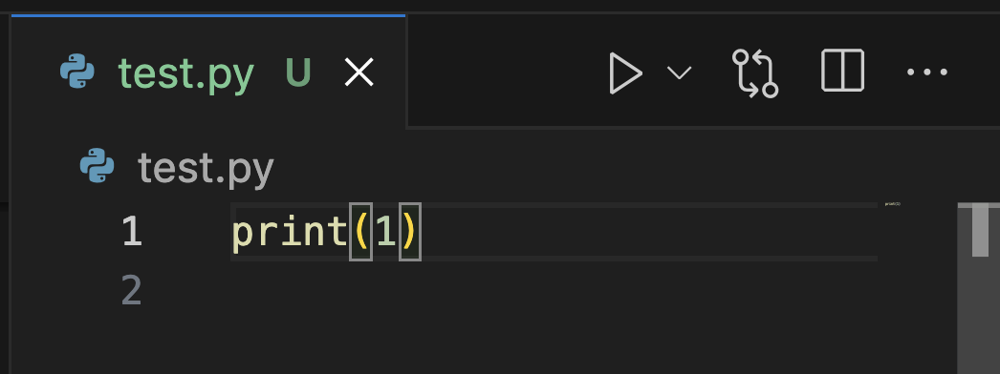

# Python環境構築
1. vscodeをインストール
   
<a>https://code.visualstudio.com/download</a>
   
1. Pythonをダウンロード
   
<a>https://www.python.org/downloads/</a>

<div align="center">



</div>

1. Pythonのダウンロードが完了したら、インストール時に"ADD PYTHON to PATH" にチェックを入れる。
   
2. VSCODEの拡張機能 "Python"をインストールする。
   
3. vecodeで拡張子.pyの新規ファイルを作成して、以下のようにコードを書き右上の三角ボタンを押すとターミナルに文字が出力される。（これができれば成功）
   
<div align="center">



</div>

# Python PIP を使用できるようにする。
1. 以下をmacターミナルで実行する。
```bash
curl https://bootstrap.pypa.io/get-pip.py -o get-pip.py
```
2. 1が完了後、以下を続けて実行する。
```bash
python3 get-pip.py
```

